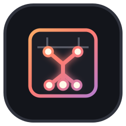
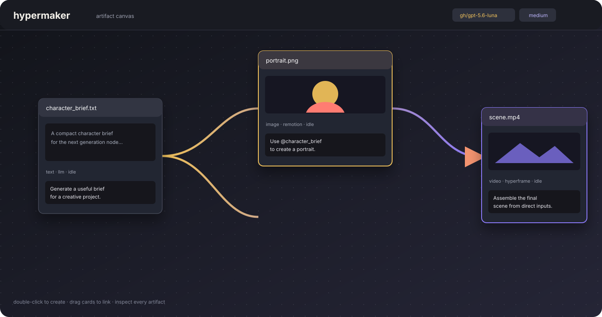

<div align="center">
  

  # Hypermaker

  ### A canvas for turning connected ideas into real artifacts. ✦

  <p><strong>Node-based agent artifact orchestration for text, images, audio, video, and whatever comes next.</strong></p>

  <p>
    <a href="https://github.com/zisisnotzis/hypermaker"></a>
    <a href="LICENSE"></a>
    <a href="https://nodejs.org/"></a>
  </p>
</div>

<p align="center">
  
</p>

> Hypermaker started around HyperFrames. It is becoming something broader: a flexible, local-first layer where an agent composes inspectable artifacts one node at a time.

## Why Hypermaker?

Terminal-driven generation is powerful, but it hides the structure of the work. Hypermaker puts that structure on a canvas:

```text
idea -> node -> artifact -> connected node -> larger artifact
                            \- inspect / repair / regenerate
```

Each generation node has a prompt, named inputs, an output type, a generation method, a script, and a rendered artifact. The agent writes and runs the script, checks the result, and hands the artifact back to the canvas. Everything stays inspectable on disk.

No diffusion or DiT model is required. Hypermaker is deliberately about code-generated, renderable work: the kind of work an LLM can explain, modify, execute, and debug.

## What you can do today

- Build a DAG by dragging cards together.
- Generate plain UTF-8 text with Codex.
- Generate still images and videos with HyperFrames or Remotion methods.
- Import existing files and recursively discover their manifest-backed parents.
- Feed direct upstream artifacts into downstream prompts with names and metadata.
- Watch the latest agent message while a node runs.
- Inspect the exact script, artifact, manifest, and `AGENTS.md` memory created for every generated node.
- Reconnect, clone, relayout, download, preview, and regenerate without leaving the canvas.

The registry is filesystem-driven. New output types and methods can be added under `types/<type>/methods/<method>.mjs` without turning the harness into a pile of special cases.

## Quick start

### Requirements

- Node.js 20 or newer
- Codex CLI, authenticated and available as `codex`
- A local browser

```bash
git clone https://github.com/zisisnotzis/hypermaker.git
cd hypermaker
npm install
npm run dev
```

Open <http://127.0.0.1:8787>.

Double-click the canvas to create a node. Pick its output type and method, write a prompt, and press **Generate**. Drag one card over another to make it an input. Import a generated artifact later and its manifest-backed tree will return with it.

For a deterministic local smoke test without a real Codex session:

```bash
npm test
```

Browser tests need a Playwright-compatible Chromium. If your environment blocks Chromium's sandbox, run them in a normal desktop/container browser environment:

```bash
npm run test:e2e
```

## The mental model

| Thing | Meaning |
| --- | --- |
| Card | One artifact-producing or imported node on the canvas |
| Input | A named direct link from another node; only direct inputs enter the prompt |
| Prompt | Human intent, combined with compact type/method guidance and context |
| Script | The reproducible source used to make the artifact |
| Artifact | The actual output shown in the card preview |
| Manifest | The small contract connecting prompt, inputs, script, output, type, and method |
| `AGENTS.md` | Useful node-local memory for future generations; empty when there is nothing worth remembering |

The agent may choose an informative artifact filename. A generated node lives in `.hypermaker/nodes/<id>/` and is created only when it is linked or generated. Imported paths remain references; they are not copied.

## Repository map

```text
server/index.mjs       local HTTP/SSE harness and Codex adapter
public/index.html      canvas UI
types/                 output-type and generation-method registry
test/                  harness and browser tests
docs/design.md         product design source of truth
docs/impl.md           implementation source of truth
vendor/                local rendering/tooling packages
```

Read [`AGENTS.md`](AGENTS.md) first when working with an agent. Read [`docs/design.md`](docs/design.md) for product intent and [`docs/impl.md`](docs/impl.md) for architecture. Those two documents are the project source of truth.

## Contributing

Hypermaker is early, exploratory, and intentionally open to new directions. Good contributions make the graph easier to understand, make agent work more reliable, or add a genuinely useful type/method without hiding behavior behind magic.

```bash
git checkout -b feat/your-idea
npm test
git diff --check
```

Please keep changes small, test the visible result, preserve plain UTF-8 artifacts, and update the source-of-truth docs when behavior changes. See [`CONTRIBUTING.md`](CONTRIBUTING.md).

## Roadmap

The current shape is a foundation, not a promise of a frozen product. Likely next directions include more artifact types and methods, stronger graph editing, richer media metadata, and better collaboration. The registry boundary exists so experimentation does not require rewriting the core.

## License

Hypermaker is free software under the [GNU Affero General Public License v3.0 or later](LICENSE).

<div align="center">
  <br />
  <strong>Connect the work. Keep the source. Ship the artifact.</strong>
</div>
